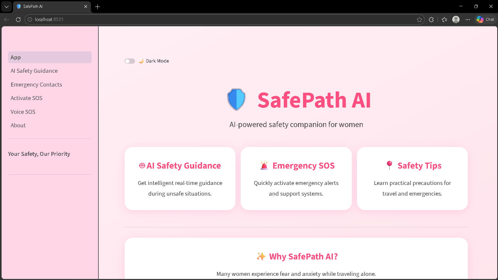
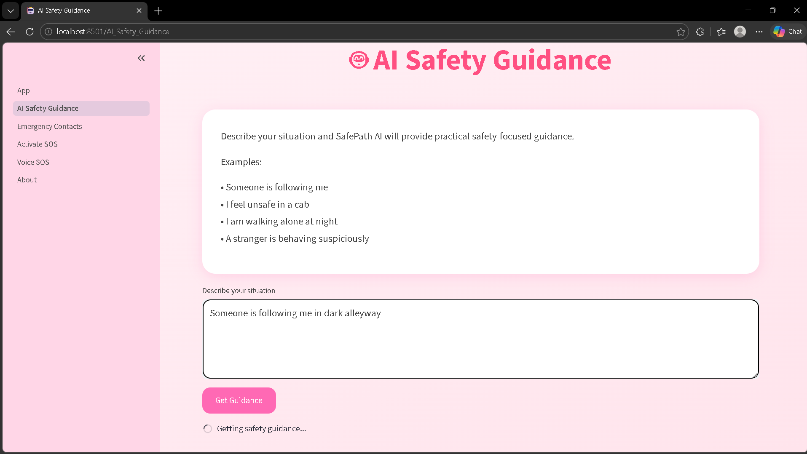
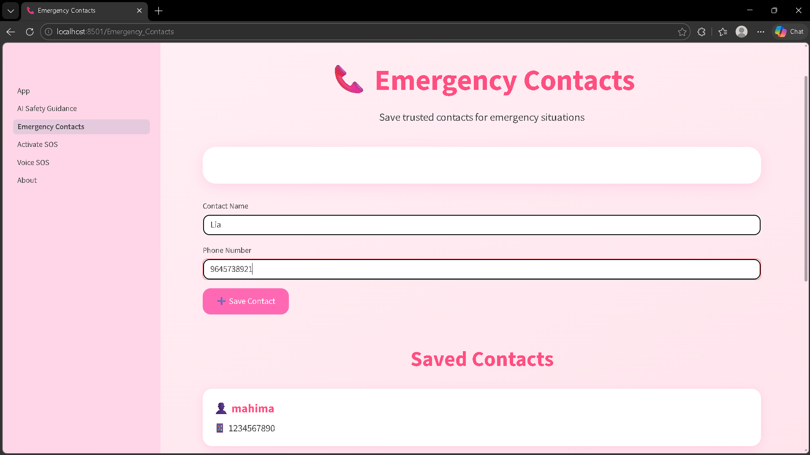
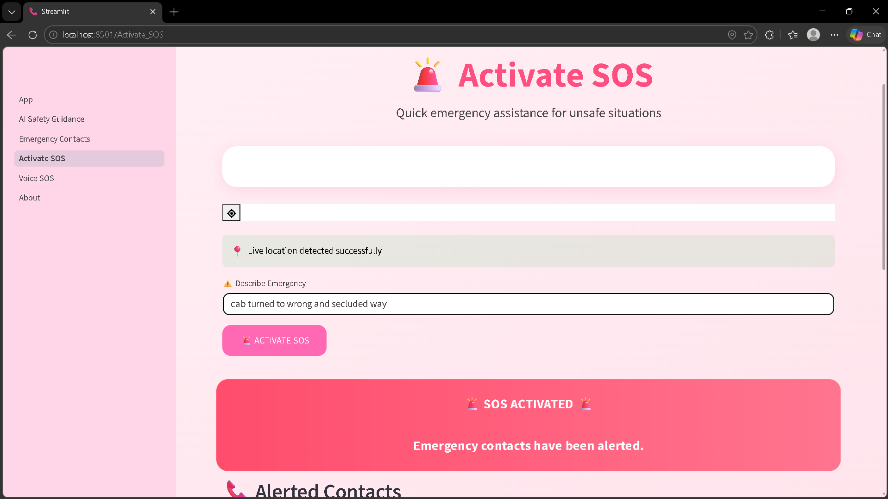
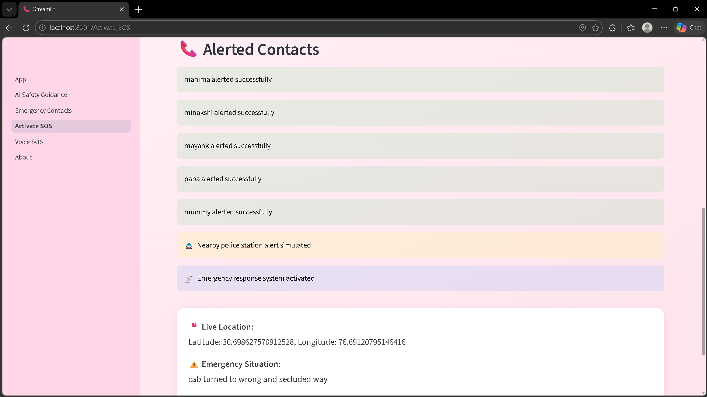
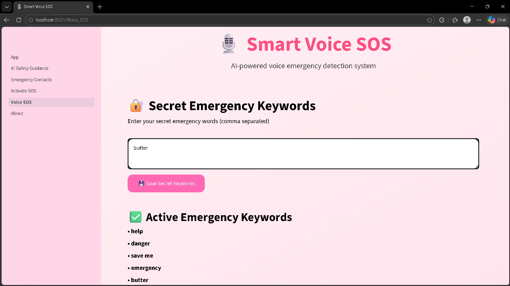
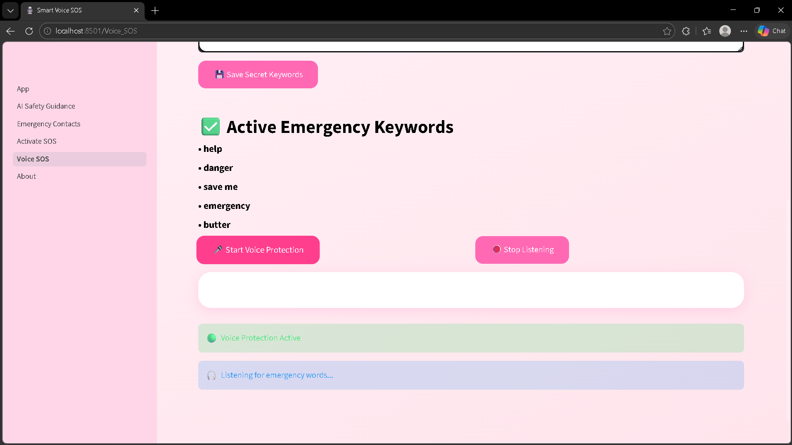

# 🛡️ SafePath AI

SafePath AI is an AI-powered women safety assistant built using Python, Streamlit, Ollama, and Gemma.

The application provides intelligent emergency guidance, SOS activation, emergency contact management, voice-triggered safety alerts, and live safety support in dangerous situations.

---

# 🚀 Features

## 🤖 AI Safety Guidance
- AI-powered emergency assistance
- Instant safety suggestions
- Offline AI support using Ollama + Gemma

## 📞 Emergency Contacts
- Save trusted emergency contacts
- Contact data stored locally
- Quick access during emergencies

## 🚨 Activate SOS
- One-click SOS activation
- Alerts emergency contacts
- Simulates nearby police station alerts
- Shares live location

## 🎙️ Smart Voice SOS
- Continuously listens for emergency keywords
- Automatically activates SOS on danger words
- Detects:
  - "help"
  - "danger"
  - "save me"
  - "emergency"

## 📍 Live Location Support
- Captures user location
- Shares coordinates during SOS activation

## 🌙 Dark / Light Theme
- Beautiful pink light mode
- Professional black & grey dark mode
- Theme persists across all pages

---

# 🧠 Technologies Used

- Python
- Streamlit
- Ollama
- Gemma 3
- SpeechRecognition
- HTML/CSS
- JSON Storage

---

# 📂 Project Structure

```bash
Safepath_AI/
│
├── app.py
├── contacts.json
│
├── pages/
│   ├── 1_AI_Safety_Guidance.py
│   ├── 2_Emergency_Contacts.py
│   ├── 3_Activate_SOS.py
│   ├── 4_Safety_Tips.py
│   ├── 5_Smart_Voice_SOS.py
│   └── 6_About.py
```

---

# Output








